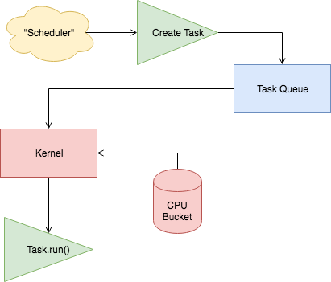

# FFS (Subject to Change)

FFS is a simple screeps operating system that takes an opinionated approach on fundamental tasks and processes that should be ran per cycle. It's currently self-sufficient up to RC3, but does need some love regarding future RC Levels and Rooms.

[](https://www.codefactor.io/repository/github/bradcypert/ffs)
[](https://codeclimate.com/github/bradcypert/ffs/maintainability)
[](https://travis-ci.com/bradcypert/ffs)

## Basic Usage

You will need:

 - [Node.JS](https://nodejs.org/en/download) (>= 8.0.0)
 - A Package Manager ([Yarn](https://yarnpkg.com/en/docs/getting-started) or [npm](https://docs.npmjs.com/getting-started/installing-node))
 - Rollup CLI (Optional, install via `npm install -g rollup`)

Download the latest source [here](https://github.com/screepers/screeps-typescript-starter/archive/master.zip) and extract it to a folder.

Open the folder in your terminal and run your package manager to install install the required packages and TypeScript declaration files:

```bash
# npm
npm install

# yarn
yarn
```

Fire up your preferred editor with typescript installed and you are good to go!

### Rollup and code upload

`rollup -c && cp ./dist/main.js main.js`

## Typings

The type definitions for Screeps come from [typed-screeps](https://github.com/screepers/typed-screeps). If you find a problem or have a suggestion, please open an issue there.

## General Flow


## How it works
This "operating system" works within the constraints provided by the Screeps game to ensure that we can schedule tasks and execute as many tasks as available within our cpu per tick.

### Scheduler
Our scheduler takes care of determining what tasks need to be created and adds those tasks to the TaskQueue

### TaskQueue
The TaskQueue is extremely simple. It's merely a queue!

### Kernel
The Kernel is responsible for reading tasks from the queue and attempting to execute them if the kernel believes we have the CPU capacity to execute these tasks. Ideally, this Kernel will one day be aware of roughly how much CPU was used to execute each task the last time they were executed. The smarter the Kernel, the better our operating system.

### CPU Bucket
The CPU bucket is provided by the game (Screeps). It is basically a monitor of how much CPU we have available. It's important to note that the CPU bucket can actually hold on to carry-over cpu from previous iterations. IE: If we are granted 10 and use 9, 1 would carry over. There is a limit to this, however.
